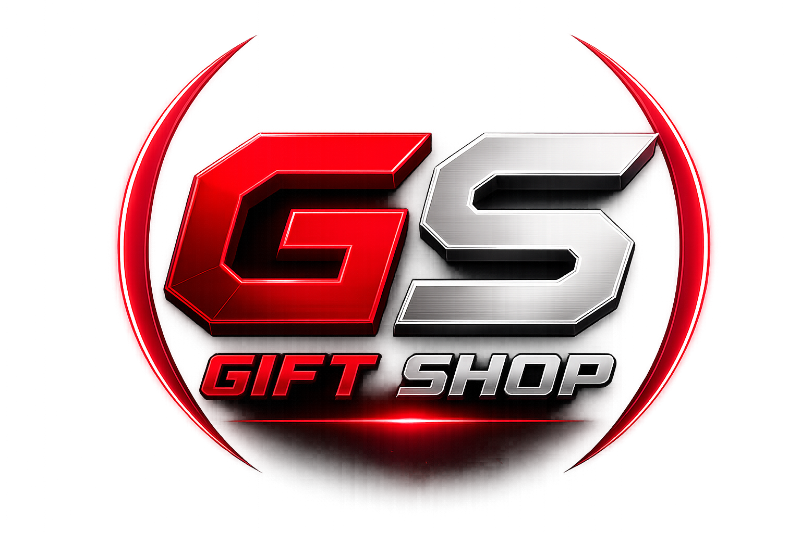

# GiftShop Panel

<div align="center">
  <a>
    
  </a>

# **GiftShop Panel**

<p align="center">
  <a href="https://t.me/Darvish001" target="_blank">
    
  </a>
</p>

</div>

---

## 🎯 Overview

GiftShop Panel is a modern and powerful management panel designed for centralized control of VPN panels and subscription services. It provides role-based access management, panel monitoring, user administration, and a responsive dashboard interface.

---

## ⛓️‍💥 Supported Panels

- [x] **3x-ui**
- [x] **Tx-ui**
- [x] **Marzban**
- [x] **Guard**
- [ ] **S-ui**

---

## ✨ Features

| Feature               | Description                                |
| --------------------- | ------------------------------------------ |
| 🔐 Role-Based Access  | Owner, Admin and Seller permissions        |
| 📊 Unified Dashboard  | Manage all connected panels from one place |
| 👥 User Management    | Create, edit and manage subscriptions      |
| 📈 Traffic Monitoring | Real-time traffic statistics               |
| 🔄 Auto Sync          | Synchronization with connected panels      |
| 🌙 Dark / Light Mode  | Modern responsive UI                       |
| 🐳 Docker Ready       | Fast deployment using Docker Compose       |
| 💾 SQLite Database    | Lightweight local database (`gs.db`)       |
| 📦 Backup & Restore   | Easy backup management                     |
| 🌍 Multi Language     | Internationalization support               |

---

## ⚡ Quick Start

### One-Line Install

```bash
bash <(curl -s https://raw.githubusercontent.com/Darvish001/giftshop-panel/main/install.sh)
```

---

## 🔄 Management Commands

After installation:

| Command                    | Description                   |
| -------------------------- | ----------------------------- |
| `giftshop-panel update`    | Pull latest image and restart |
| `giftshop-panel edit-env`  | Edit configuration            |
| `giftshop-panel start`     | Start panel                   |
| `giftshop-panel stop`      | Stop panel                    |
| `giftshop-panel restart`   | Restart panel                 |
| `giftshop-panel logs`      | View logs                     |
| `giftshop-panel uninstall` | Remove panel                  |

---

## 🐳 Manual Installation

```bash
git clone https://github.com/Darvish001/giftshop-panel.git

cd giftshop-panel

cp .env.example .env

docker compose up -d
```

---

## 📂 Database

Default database:

```text
gs.db
```

Location:

```text
/app/data/gs.db
```

---

## 🏗️ Roadmap

- [ ] PostgreSQL Support
- [ ] Multi Server Cluster
- [ ] Telegram Bot Integration
- [ ] Automatic Backups
- [ ] Seller Management
- [ ] Payment Gateway Integration
- [ ] Advanced Analytics

---

## 🤝 Contributing

Contributions, suggestions and feature requests are welcome.

---

<div align="center">
  <sub>Developed by Darvish ❤️</sub>
</div>
